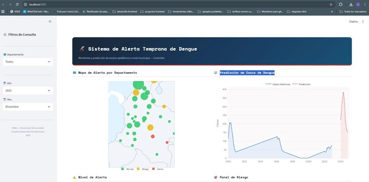
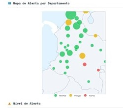

# Manual de Usuario

## 1. Introducción

El Sistema de Alerta Temprana de Dengue es una aplicación web interactiva que permite estimar y visualizar la probabilidad de exceso epidémico de dengue a nivel departamental o municipal en Colombia.
El sistema utiliza un modelo de Regresión Logística previamente entrenado, el cual calcula la variable probabilidad_exceso y clasifica el riesgo en tres niveles:
- 🟢 Normal
- 🟡 Riesgo 
- 🔴 Alerta

El usuario puede:
- Explorar el nivel de alerta por territorio
- Analizar la evolución temporal
- Consultar variables contextuales
- Descargar reportes en formato CSV

# 2. Vista General del Sistema

Figura 1. Vista general del Sistema de Alerta Temprana

La vista principal contiene:
- Barra lateral de filtros
- Mapa interactivo por departamento
- Gráfica de casos históricos y predicción
- Panel de riesgo detallado
- Opción de descarga de reporte

# 3. Filtros de Consulta

**Paso 1. Seleccionar ubicación**

En la barra lateral izquierda, el usuario puede seleccionar: 
- Departamento. 

Si se deja en "Todos", el sistema muestra la vista agregada nacional.

**Paso 2. Seleccionar período**

El usuario debe seleccionar:
- Año
- Mes

Estos filtros determinan el período para el cual se calcula la probabilidad de exceso.
*Nota: Es importante seleccionar primero el año y luego el mes para actualizar correctamente la predicción.*

Figura 2. Barra lateral de filtros

# 4. Mapa de Alerta Departamental

El mapa muestra la distribución espacial del riesgo para el período seleccionado. Cada territorio se representa mediante un color:

 - 🟢 Verde → Normal 
 - 🟡 Amarillo → Riesgo 
 - 🔴 Rojo → Alerta

El tamaño del marcador puede reflejar magnitud de casos o probabilidad.

Figura 3. Mapa de alerta por departamento

Interacción:

 - Al pasar el cursor sobre un departamento se muestran detalles.
 - Permite identificar patrones geográficos de riesgo.

# 5. Serie Temporal de Casos

La gráfica "Predicción de Casos de Dengue" muestra:
 - Línea azul: casos históricos
 - Línea roja punteada: período de predicción
Esto permite comparar:
 - Tendencia histórica
 - Comportamiento reciente
 - Proyección estimada
 
📷 Figura 3. Serie temporal histórica y predicción
(Recomendado incluir imagen solo de la gráfica)

  

# 6. Nivel de Alerta (Probabilidad)

📷 Figura 4. Nivel de alerta y zonas de clasificación
(Usa tu segunda imagen parte izquierda)
Esta gráfica muestra:

 - Evolución histórica de la probabilidad estimada
 - Zonas de clasificación: 
	 - Verde: Normal
	 - Amarillo: Riesgo
	 - Rojo: Alerta

Permite entender si el territorio está:
 - En aumento progresivo
 - En zona estable
 - En transición hacia alerta

  

# 7. Panel de Riesgo

📷 Figura 5. Panel de riesgo del período seleccionado
(Parte derecha de la segunda imagen)
El panel muestra:

  

 - Información principal
	 - Probabilidad estimada de brote (ej: 16%)
	 - Clasificación correspondiente
	 - Período consultado
 - Variables contextuales
	 - Lluvia (mm)
	 - Temperatura (°C)
	 - NDVI
	 - Población
	 - Casos en el mes

Esto permite contextualizar la predicción del modelo.

 # 8. Descarga de Reporte

El botón "Descargar Reporte" permite exportar los resultados del período seleccionado en formato CSV.

El archivo incluye:

 - Departamento / Municipio
 - Año
 - Mes
 - Probabilidad estimada
 - Nivel de alerta
 - Variables climáticas
 - Casos históricos

Este archivo puede utilizarse para:
- Análisis adicional
- Reportes institucionales
- Seguimiento interno

📷 (Opcional: captura del botón resaltado)

# 9. Interpretación del Nivel de Riesgo

|Nivel |Interpretación |  Acción sugerida|

|--|--|

|Normal |Probabilidad baja |Seguimiento rutinario|

|Riesgo |Probabilidad moderada |Intensificar vigilancia|

|Alerta |Probabilidad alta |Activar medidas de control|

⚠ Importante:
*El sistema es una herramienta de apoyo a la decisión y no reemplaza los protocolos oficiales de vigilancia.*

# 10. Consideraciones Técnicas
- Modelo: Regresión Logística
- Variable objetivo: Exceso epidemiológico
- Horizonte temporal: mensual
- Actualización: basada en datos históricos consolidados